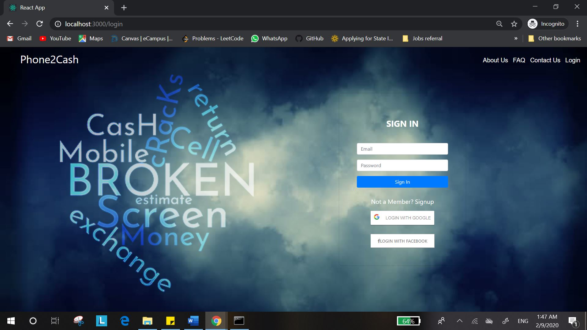
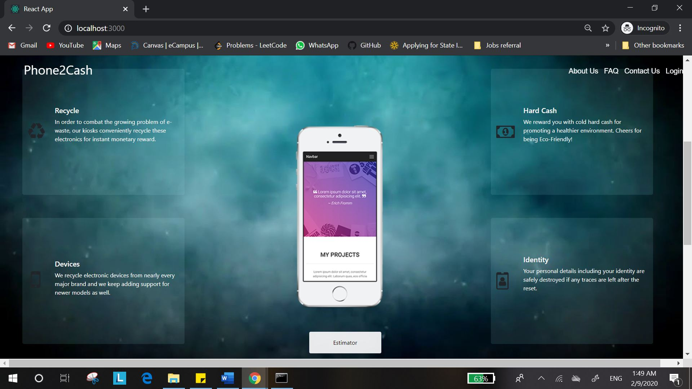

# Broken Phone Value Estimator
An application which estimates the cost of a phone by considering its screen condition, whether
broken or intact, and its original price.

# Application

## Abstract

A streamlined process of turning in our old mobiles in exchange for cash would significantly
simplify the hassle of online search of prices and negotiations for a fair deal. A proposed
solution to this could be a vending machine which takes the phone, scans it and reckons the
price of it. If satisfied with the price, a cheque could be dispensed for the equivalent amount
offered.

As a part of the solution, an application is to be designed, which takes the images of a
damaged phone as input and quantifies the value of the phone based on the damage to the
screen. Instead of a fixed price system that provides static output prices, without the
consideration of the state of the phone, an ingenious system that estimates based on the
condition of the phone can be developed.

To pull this off, a trained machine learning model is used to analyze the data set of
captured images. The model is initially trained with data of various broken phone images. An
interactive user interface with ReactJS, secured with authentication factors is designed for the
ease of the customer where the model of the phone must be entered to gauge the original cost
of the phone. Based on results, the percentage of cracks, combined with the standard model
prices, final price of the mobile can be predicted.

## Technology stack
**Programming languages & Libraries**: Python, Pytorch, scikit-learn

**Technologies**: Machine Learning, Computer Vision, Deep Learning

**Web Technologies**: HTML5, CSS3, JavaScript, React, Redux, Node.JS, REST API

**Miscellaneous** : SOA, Agile, Git, Anaconda

## Architecture Diagram

## Hill Statement
 **Who** : A Mobile phone user 
 
 **What** : Can trade in a broken mobile for cash
 
 **Wow** : In considerably lower time than traditional selling procedure
 
## Persona

## Contributors
C. Vamsi Krishna

D. Sri Hari

G. Vishal

K. Farha
